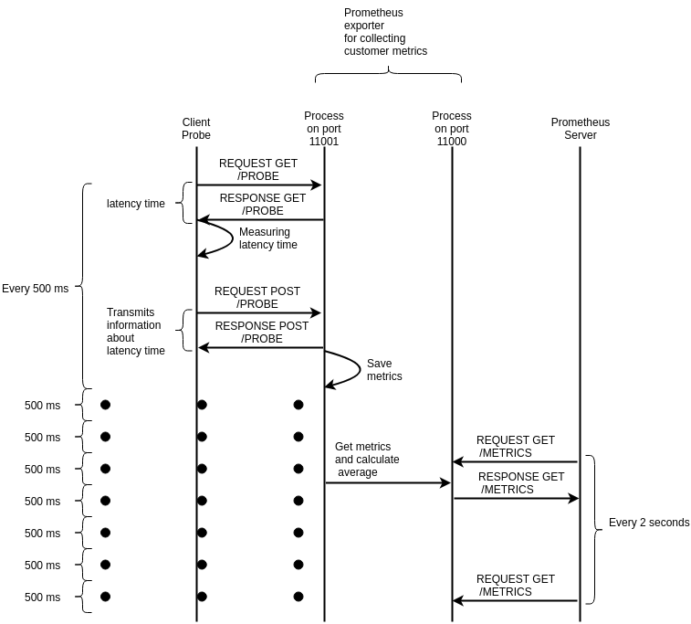

## **Prometheus exporter for collecting customers’/clients’ metrics (PECCM)**

Prometheus exporter for collecting customers’/clients’ metrics (PECCM) is an exporter which receives metrics from clients and saves stores them in memory. The Monitoring Platform5Gr-VoMS grabs the collected metrics from the exporter by a request which for later processing afterward processed. PECCM is installed dynamically according to the NSD by using the RVM agent. 
#### The PECCM’s workflow is shown at the following figure.




**Video Stream consists of video fragments.**

**When HLS JS player receives video fragment:**


1. it measures latency time, loading time, parsing time, time of appending to buffer and bandwidth;
2. client probe sends collected metrics to PECCM by making  POST Request with URL /probe

**Every 2 seconds:**


1. Prometheus Server makes a request to PECCM on port 11000;
2. PECCM responses to Prometheus Server.

**Installation**

In the code folder, run the following commands:


```
pip3 install -r /opt/peccm_exporter/requirements.txt
python3 server_probe.py
