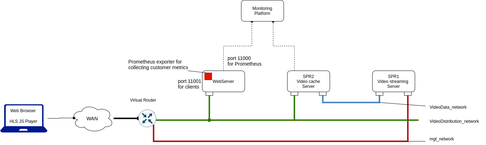

## The example of integration client-side probe into hls.js player

The schema for native client-side monitoring is shown at the following figure.



*   hls.js player is used as the source of metrics instead;
*   hls.js is a JavaScript library which implements an HTTP Live Streaming client;
*   hls.js is released under Apache 2.0 License.

```
The folder "probe/code" contains Web page with an HLS player with the built-in client-side probe.

The file probe/code/clientprobe/clientprobe.config.js contain variable probe_mode.
probe_mode has variable the following values:
```
> *   `"check" client probe makes GET request, measures response time and reports data to probe server by using POST request`
> *   `"report_metrics" client probe sends video player's metrics to probe server`