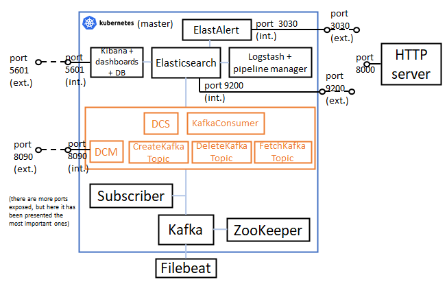

# 1. Microservices deployment (Kubernetes version integrating ElastAlert - DEMO for 5GROWTH WP2 meeting)  

This README file contains all the steps to be followed to deploy this scenario, based on Kubernetes, in which it is presented the Monitoring platform based on microservices, including a preliminary version of Elastalert. It also includes Filebeat and a HTTP server, but they are executed in the same server, and not as pods.



## Docker images involved

The following Docker images have been used for this deployment. Please verify that these images have been built beforehand.

* **Complex Python subscriber:** available in this repository: [complex_subscriber](../../docker_images/old/complex_subscriber).
* **Create Kafka Topic:** available in this repository: [create_kafka_topic](../../docker_images/create_kafka_topic).
* **DCM:** available in this repository: [dcm](../../docker_images/old/dcm).
* **DCS:** available in this repository: [dcs](../../docker_images/old/dcs).
* **Delete Kafka Topic:** available in this repository: [delete_kafka_topic](../../docker_images/delete_kafka_topic).
* **ElastAlert:** available in this repository: [elastalert](../../docker_images/elastalert/v2).
* **Elasticsearch:** available in this repository: [elasticsearch](../../docker_images/elasticsearch/original).
* **Fetch Kafka Topic:** available in this repository: [fetch_kafka_topic](../../docker_images/fetch_kafka_topic).
* **Kafka:** available in this repository: [kafka](../../docker_images/old/kafka/original).
* **Kafka Consumer:** available in this repository: [kafka_consumer](../../docker_images/kafka_consumer).
* **Kibana:** available in this repository: [kibana](../../docker_images/kibana/original).
* **Logstash Pipeline Manager:** available in this repository: [logstash_pipeline_manager](../../docker_images/logstash_pipeline_manager).
* **ZooKeeper:** available in this repository: [zookeeper](../../docker_images/old/zookeeper).

## Steps to be followed

### 1. Run all pods

Before running the pods, check the following:

* The Kubernetes node uses Docker as container daemon.
* You have built all the Docker images referenced in pods' specification.

Then, execute the following (you have to be in the directory containing this README to execute these commands):

```sh
$ kubectl apply -f ./pods/create_kafka_topic_pod.yml
$ kubectl apply -f ./pods/dcm_pod.yml
$ kubectl apply -f ./pods/dcs_pod.yml
$ kubectl apply -f ./pods/delete_kafka_topic_pod.yml
$ kubectl apply -f ./pods/elasticsearch_pod.yml
$ kubectl apply -f ./pods/fetch_kafka_topic_pod.yml
$ kubectl apply -f ./pods/kafka_consumer_pod.yml
$ kubectl apply -f ./pods/kafka_pod.yml
$ kubectl apply -f ./pods/kibana_pod.yml
$ kubectl apply -f ./pods/logstash_pipeline_manager_pod.yml
$ kubectl apply -f ./pods/subscriber_pod.yml
$ kubectl apply -f ./pods/zookeeper_pod.yml
$ kubectl apply -f ./pods/elastalert_pod.yml
```

For the ElastAlert pod, the file pod_config_map/elastalert_pod_config_map.yml can be alternatively used if you want to have all ElastAlert server parameters included in the same pod definition file.  

After this, take note of pods' IP addresses by running this:

```sh
$ kubectl get pods -o wide
```

You should obtain something like this:

```
NAME                        READY   STATUS    RESTARTS   AGE    IP            NODE                     NOMINATED NODE   READINESS GATES
dcm                         1/1     Running   0          135m   10.42.0.147   5geve-k3s-master-monit   <none>           <none>
dcs                         1/1     Running   0          135m   10.42.0.148   5geve-k3s-master-monit   <none>           <none>
delete-kafka-topic          1/1     Running   0          135m   10.42.0.149   5geve-k3s-master-monit   <none>           <none>
create-kafka-topic          1/1     Running   0          135m   10.42.0.146   5geve-k3s-master-monit   <none>           <none>
elasticsearch               1/1     Running   0          135m   10.42.0.150   5geve-k3s-master-monit   <none>           <none>
fetch-kafka-topic           1/1     Running   0          135m   10.42.0.151   5geve-k3s-master-monit   <none>           <none>
kafka-consumer              1/1     Running   0          135m   10.42.0.152   5geve-k3s-master-monit   <none>           <none>
kafka                       1/1     Running   0          135m   10.42.0.153   5geve-k3s-master-monit   <none>           <none>
logstash-pipeline-manager   1/1     Running   0          135m   10.42.0.155   5geve-k3s-master-monit   <none>           <none>
subscriber                  1/1     Running   0          135m   10.42.0.156   5geve-k3s-master-monit   <none>           <none>
kibana                      1/1     Running   0          135m   10.42.0.154   5geve-k3s-master-monit   <none>           <none>
zookeeper                   1/1     Running   0          135m   10.42.0.157   5geve-k3s-master-monit   <none>           <none>
elastalert                  1/1     Running   0          135m   10.42.0.158   5geve-k3s-master-monit   <none>           <none>

```

To use these IP addresses in the following commands, you can export the IPs to environment variables (remember to execute the commands in all terminals you are going to use):

```sh
$ dcm_ip_address=$(sudo kubectl get pods -o wide | grep dcm | awk '{print $6}')
$ create_kafka_topic_ip_address=$(sudo kubectl get pods -o wide | grep create-kafka-topic | awk '{print $6}')
$ delete_kafka_topic_ip_address=$(sudo kubectl get pods -o wide | grep delete-kafka-topic | awk '{print $6}')
$ dcs_ip_address=$(sudo kubectl get pods -o wide | grep dcs | awk '{print $6}')
$ elasticsearch_ip_address=$(sudo kubectl get pods -o wide | grep elasticsearch | awk '{print $6}')
$ kafka_consumer_ip_address=$(sudo kubectl get pods -o wide | grep kafka-consumer | awk '{print $6}')
$ fetch_kafka_topic_ip_address=$(sudo kubectl get pods -o wide | grep fetch-kafka-topic | awk '{print $6}')
$ kafka_ip_address=$(sudo kubectl get pods -o wide | grep '^kafka ' | awk '{print $6}')
$ kibana_ip_address=$(sudo kubectl get pods -o wide | grep kibana | awk '{print $6}')
$ logstash_ip_address=$(sudo kubectl get pods -o wide | grep logstash-pipeline-manager | awk '{print $6}')
$ subscriber_ip_address=$(sudo kubectl get pods -o wide | grep subscriber | awk '{print $6}')
$ zookeeper_ip_address=$(sudo kubectl get pods -o wide | grep zookeeper | awk '{print $6}')
$ elastalert_ip_address=$(sudo kubectl get pods -o wide | grep elastalert | awk '{print $6}')

# To check the IP addresses:
$ echo $dcm_ip_address
$ echo $create_kafka_topic_ip_address
$ echo $delete_kafka_topic_ip_address
$ echo $dcs_ip_address
$ echo $elasticsearch_ip_address
$ echo $kafka_consumer_ip_address
$ echo $fetch_kafka_topic_ip_address
$ echo $kafka_ip_address
$ echo $kibana_ip_address
$ echo $logstash_ip_address
$ echo $subscriber_ip_address
$ echo $zookeeper_ip_address
$ echo $elastalert_ip_address
```

### 2. Configure Kafka

Run the following scripts to configure the Kafka container:

```sh
$ kubectl exec kafka -- /bin/bash update_hosts.sh $kafka_ip_address dcm
$ kubectl exec kafka -- /bin/bash entrypoint.sh PLAINTEXT://0.0.0.0:9092 PLAINTEXT://dcm:9092 1 $zookeeper_ip_address > /dev/null &
```

And also, you can check in ZooKeeper pod that Kafka has correctly joined to ZooKeeper:

```sh
$ kubectl exec -it zookeeper -- /opt/kafka/bin/zookeeper-shell.sh $zookeeper_ip_address:2181 ls /brokers/ids
```

### 3. Configure the ELK Stack with ElastAlert

First of all, start by running Elasticsearch:

```sh
$ kubectl exec elasticsearch -- /bin/bash entrypoint.sh &
```

Then, run Kibana:

```sh
$ kubectl exec kibana -- /bin/bash entrypoint.sh $kibana_ip_address \"http://$elasticsearch_ip_address:9200\" &
```

Continue by running Logstash:

```sh
$ kubectl exec logstash_pipeline_manager -- /bin/bash update_hosts.sh $kafka_ip_address dcm
$ kubectl exec logstash_pipeline_manager -- /bin/bash entrypoint.sh \"http://$elasticsearch_ip_address:9200\" $kafka_ip_address:9092 $elasticsearch_ip_address:9200 &
```

## 4. Deploy microservices

Then, it is time to create the microservices related to the serverless functions.

First of all, start by running the DCM:

```sh
$ kubectl exec dcm -- /bin/bash entrypoint.sh $dcs_ip_address:8091 $create_kafka_topic_ip_address:8190 $delete_kafka_topic_ip_address:8290 $fetch_kafka_topic_ip_address:8390 &
```

Continue with the DCS:

```sh
$ kubectl exec dcs -- /bin/bash entrypoint.sh $kibana_ip_address:8080 $logstash_ip_address:8191 $kafka_consumer_ip_address:8291 $elasticsearch_ip_address:9200 &
```

Then, the Create Kafka Topic service:

```sh
$ kubectl exec create_kafka_topic -- /bin/bash update_hosts.sh $kafka_ip_address dcm
$ kubectl exec create_kafka_topic -- /bin/bash entrypoint.sh $kafka_ip_address:9092 &
```

Next, the Delete Kafka Topic service:

```sh
$ kubectl exec delete_kafka_topic -- /bin/bash update_hosts.sh $kafka_ip_address dcm
$ kubectl exec delete_kafka_topic -- /bin/bash entrypoint.sh $kafka_ip_address:9092 &
```

Continue with the Fetch Kafka Topic service:

```sh
$ kubectl exec fetch_kafka_topic -- /bin/bash update_hosts.sh $kafka_ip_address dcm
$ kubectl exec fetch_kafka_topic -- /bin/bash entrypoint.sh $kafka_ip_address:9092 &
```

And finally, deploy the Kafka Consumer service:

```sh
$ kubectl exec kafka_consumer -- /bin/bash update_hosts.sh $kafka_ip_address dcm
$ kubectl exec kafka_consumer -- /bin/bash entrypoint.sh $kibana_ip_address:8080 $kafka_ip_address:9092 &
```

### 5. Create a new topic with the DCM handler

Send a new application metric topic to be created in the platform. Use the IP address of the node that contains the DCM pod, changing *<node_containing_dcm_pod_ip_address>* as a result.

```sh
$ curl --location --request POST 'http://<node_containing_dcm_pod_ip_address>:8090/dcm/subscribe' \
--header 'Content-Type: application/json' \
--data-raw '{
    "records": [
        {
            "value": {
                "topic": "uc.4.france_nice.application_metric.service_delay",
                "expId": "4",
                "action": "subscribe",
                "context": {
                    "metricId": "service_delay",
                    "metricCollectionType": "CUMULATIVE",
                    "graph": "LINE",
                    "name": "metric_name",
                    "unit": "metric_unit",
                    "interval": "5s"
                }
            }
        }
    ]
}'
```

If you list the topics currently created, you will see that uc.4.france_nice.application_metric.service_delay has been created.

```sh
$ kubectl exec kafka -- /bin/bash /opt/kafka/bin/kafka-topics.sh --list --zookeeper $zookeeper_ip_address:2181
```

Finally, open a new terminal in Logstash Pipeline Manager pod in order to run it, so that it subscribes to the topic created. Wait until the logs are stopped.

```sh
$ kubectl exec -it logstash_pipeline_manager -- /bin/bash
# Within the server:
$ source /etc/default/logstash
$ /usr/share/logstash/bin/logstash "--path.settings" "/etc/logstash" # terminal will be blocked then
```

### 6. Run Filebeat

Follow the following steps to install Filebeat in a specific server (if not installed previously):

```sh
$ cd /tmp
$ wget https://artifacts.elastic.co/downloads/beats/filebeat/filebeat-7.5.0-amd64.deb
$ dpkg -i /tmp/filebeat-7.5.0-amd64.deb
$ rm /tmp/filebeat-7.5.0-amd64.deb

# Check that Filebeat service is stopped (we will execute it manually)
$ systemctl stop filebeat
```

Then, remove the Filebeat configuration file provided by default:

```sh
$ rm /etc/filebeat/filebeat.yml
```

Create a new */etc/filebeat/filebeat.yml* with the following content, changing *<node_containing_kafka_pod_ip_address>* consequently:

```
filebeat.inputs:
  - input_type: log
    fields:
      topic_id: uc.4.france_nice.application_metric.service_delay
    paths:
      - /var/log/uc.4.france_nice.application_metric.service_delay.log

processors:
  - decode_csv_fields:
      fields:
        message: decoded_csv_arr
      separator: ","
      ignore_missing: false
      overwrite_keys: true
      trim_leading_space: false
      fail_on_error: true

  - script:
      lang: javascript
      id: convert_csv_into_json
      source: >
        function process(event) {
            var csv_arr = event.Get("decoded_csv_arr");
            var json_fields = ["metric_value", "timestamp", "unit", "device_id", "context"];
            var json_from_csv =  csv_arr.reduce(function(result, field, index) {
              result[json_fields[index]] = field;
              return result;
            }, {})
            json_from_csv["metric_value"] = parseFloat(json_from_csv["metric_value"])
            json_from_csv["timestamp"] = parseFloat(json_from_csv["timestamp"])
            var value = {
              value: json_from_csv
            };
            var record = [value];
            event.Put("records", record);
        }
  - drop_fields:
      fields: ["decoded_csv_arr"]

output.kafka:
  hosts: ["<node_containing_kafka_pod_ip_address>:9092"]
  topic: "%{[fields][topic_id]}"
```

Do not forget to include an entry in the /etc/hosts file in Filebeat's server with the following content, changing *<node_containing_kafka_pod_ip_address>* consequently:

```
<node_containing_kafka_pod_ip_address> dcm
```

And finally, in a different terminal, check that the configuration file provided before is correct and run Filebeat:

```sh
$ filebeat test config
$ filebeat test output
$ filebeat -e -d "publish" # alternative: systemctl start filebeat -> and check the logs with journalctl -fu filebeat
```

### 7. Post ElastAlert alert rule to ElastAlert server's REST API

``` sh
$ curl --location --request POST 'http://$elastalert_ip_address:3030/rules/FILEBEAT' \
--header 'Content-Type: application/json' \
--data-raw '{
"yaml": "es_host: \"$elastalert_ip_address\"\nes_port: 9200\nname: \"FILEBEAT\"\ntype: frequency\nindex: uc.4.france_nice.application_metric.service_delay\nnum_events: 10\ntimeframe:\n seconds: 15\nalert:\n- command\ncommand: [\"curl\", \"<HTTP_SERVER_IP_ADDRESS>:8000\"]"
}'
```

This alert rule instructs Elastalert server to monitor Elasticsearch index's frequency and to send alert to <HTTP_SERVER_IP_ADDRESS> by running an empty curl command.


### 8. Start server receiving alerts

Start the HTTP server that will receive this alert (requires Python 3 installed in the server) with the following command in a new terminal:

```sh
$ python3 -m http.server
```

### 9. Generate data to be published by Filebeat

Open a new terminal in the server containing Filebeat and execute the following commands. After this, you will start publishing data to Filebeat (10 metrics, 1 per second), following the information model defined in 5G EVE:

```sh
$ sudo su
$ for i in {1..10}; do timestamp=$(date +"%s"); echo "$i,$timestamp,rand,vnf,null"  >> /var/log/uc.4.france_nice.application_metric.service_delay.log; sleep 1; done
```

In the terminal containing the HTTP server, you will receive then a request from ElastAlert, as the condition defined for the rule has been achieved.

Moreover, check that the DCS-DV receives the messages sent by the publisher (you can go to the Kibana GUI with http://<node_containing_kibana_pod_ip_address>:5601 and take a look to the Kibana index receiving the data, the Kibana dashboard generated, the Elasticsearch index increasing the counter of messages received, etc.).

You can also run the subscriber in order to confirm that it receives the messages sent by the publisher (i.e. Filebeat).

### 10. Delete the topic created by the DCM handler

Remove the topic created previously by the DCM handler by sending this request, changing *<node_containing_dcm_pod_ip_address>* as a result.

```sh
$ curl --location --request DELETE 'http://<node_containing_dcm_pod_ip_address>:8090/dcm/unsubscribe' \
--header 'Content-Type: application/json' \
--data-raw '{
    "records": [
        {
            "value": {
                "topic": "uc.4.france_nice.application_metric.service_delay",
                "expId": "4",
                "action": "unsubscribe",
                "context": {
                    "metricId": "service_delay",
                    "metricCollectionType": "CUMULATIVE",
                    "graph": "LINE",
                    "name": "metric_name",
                    "unit": "metric_unit",
                    "interval": "5s"
                }
            }
        }
    ]
}'
```

After this, you can close Logstash, Filebeat (or execute *systemctl stop filebeat* if you used the other alternative), ElastAlert and the HTTP server in the terminals opened for these purposes.

If you list the topics currently created, you will see that uc.4.france_nice.application_metric.service_delay has been deleted.

```sh
$ kubectl exec kafka -- /bin/bash /opt/kafka/bin/kafka-topics.sh --list --zookeeper $zookeeper_ip_address:2181
```

### 11. Cleaning the scenario

To clean the scenario, you can execute the following commands:

```sh
$ kubectl delete -f ./pods/create_kafka_topic_pod.yml
$ kubectl delete -f ./pods/dcm_pod.yml
$ kubectl delete -f ./pods/dcs_pod.yml
$ kubectl delete -f ./pods/delete_kafka_topic_pod.yml
$ kubectl delete -f ./pods/elasticsearch_pod.yml
$ kubectl delete -f ./pods/fetch_kafka_topic_pod.yml
$ kubectl delete -f ./pods/kafka_consumer_pod.yml
$ kubectl delete -f ./pods/kafka_pod.yml
$ kubectl delete -f ./pods/kibana_pod.yml
$ kubectl delete -f ./pods/logstash_pipeline_manager_pod.yml
$ kubectl delete -f ./pods/subscriber_pod.yml
$ kubectl delete -f ./pods/zookeeper_pod.yml
$ kubectl delete -f ./pods/elastalert_pod.yml
```

Also remove Filebeat log file for future executions:

```sh
$ rm /var/log/uc.4.france_nice.application_metric.service_delay.log
```
