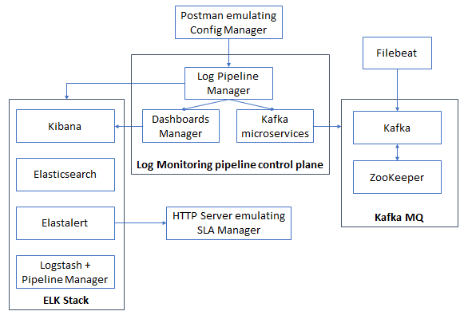

# 1. Microservices deployment (Kubernetes)

This README file contains all the steps to be followed to deploy this scenario, based on Kubernetes, in which it is presented the Log Monitoring platform based on microservices. It also includes Filebeat, but it is executed in the same server, and not as a pod.



## Docker images involved

The following Docker images have been used for this deployment. Please verify that these images have been built beforehand.

> Use --no-cache option when building the images if you find problems with the apt-get update command.


* **Create Kafka Topic:** available in this repository: [create_kafka_topic](../../docker_images/create_kafka_topic).
* **Delete Kafka Topic:** available in this repository: [delete_kafka_topic](../../docker_images/delete_kafka_topic).
* **ElastAlert:** available in this repository: [elastalert](../../docker_images/elastalert/v3).
* **Elasticsearch:** available in this repository: [elasticsearch](../../docker_images/elasticsearch/original).
* **Fetch Kafka Topic:** available in this repository: [fetch_kafka_topic](../../docker_images/fetch_kafka_topic).
* **HTTP server:** available in this repository: [kafka](../../docker_images/http_server).
* **Kafka:** available in this repository: [kafka](../../docker_images/kafka/original).
* **Kafka Consumer:** available in this repository: [kafka_consumer](../../docker_images/kafka_consumer).
* **Kibana:** available in this repository: [kibana](../../docker_images/kibana/original).
* **Kibana Dashboard:** available in this repository: [kibana_dashboards](../../docker_images/kibana_dashboards/original).
* **Log Pipeline Manager:** available in this repository: [log_pipeline_manager](../../docker_images/log_pipeline_manager/v1).
* **Logstash Pipeline Manager:** available in this repository: [logstash_pipeline_manager](../../docker_images/logstash_pipeline_manager/v2).
* **ZooKeeper:** available in this repository: [zookeeper](../../docker_images/zookeeper/v2).

## Steps to be followed

### 1. Run all pods

Before running the pods, check the following:

* The Kubernetes node uses Docker as container daemon.
* You have built all the Docker images referenced in pods' specification.

Then, execute the following (you have to be in the directory containing this README to execute these commands).

> For the ElastAlert pod, the file pods/config_map/elastalert_pod_config_map.yml can be alternatively used if you want to have all ElastAlert server parameters included in the same pod definition file.  

```sh
$ kubectl apply -f ./pods/create_kafka_topic_pod.yml
$ kubectl apply -f ./pods/delete_kafka_topic_pod.yml
$ kubectl apply -f ./pods/elastalert_pod.yml
$ kubectl apply -f ./pods/elasticsearch_pod.yml
$ kubectl apply -f ./pods/fetch_kafka_topic_pod.yml
$ kubectl apply -f ./pods/http_server_pod.yml
$ kubectl apply -f ./pods/kafka_pod.yml
$ kubectl apply -f ./pods/kafka_consumer_pod.yml
$ kubectl apply -f ./pods/kibana_pod.yml
$ kubectl apply -f ./pods/kibana_dashboard_pod.yml
$ kubectl apply -f ./pods/log_pipeline_manager_pod.yml
$ kubectl apply -f ./pods/logstash_pipeline_manager_pod.yml
$ kubectl apply -f ./pods/zookeeper_pod.yml
```

After this, take note of pods' IP addresses by running this:

```sh
$ kubectl get pods -o wide
```

You should obtain something like this:

```
NAME                        READY   STATUS    RESTARTS   AGE     IP           NODE             NOMINATED NODE   READINESS GATES
create-kafka-topic          1/1     Running   0          4m12s   10.42.0.15   log-monitoring   <none>           <none>
delete-kafka-topic          1/1     Running   0          3m27s   10.42.0.16   log-monitoring   <none>           <none>
elasticsearch               1/1     Running   0          3m26s   10.42.0.18   log-monitoring   <none>           <none>
fetch-kafka-topic           1/1     Running   0          3m25s   10.42.0.19   log-monitoring   <none>           <none>
kafka-consumer              1/1     Running   0          3m24s   10.42.0.22   log-monitoring   <none>           <none>
kibana-dashboard            1/1     Running   0          3m23s   10.42.0.24   log-monitoring   <none>           <none>
kibana                      1/1     Running   0          3m23s   10.42.0.23   log-monitoring   <none>           <none>
log-pipeline-manager        1/1     Running   0          3m22s   10.42.0.25   log-monitoring   <none>           <none>
elastalert                  1/1     Running   0          15s     10.42.0.28   log-monitoring   <none>           <none>
http-server                 1/1     Running   0          9s      10.42.0.29   log-monitoring   <none>           <none>
kafka                       1/1     Running   0          7s      10.42.0.30   log-monitoring   <none>           <none>
logstash-pipeline-manager   1/1     Running   0          3s      10.42.0.31   log-monitoring   <none>           <none>
zookeeper                   1/1     Running   0          2s      10.42.0.32   log-monitoring   <none>           <none>
```

To use these IP addresses in the following commands, you can export the IPs to environment variables. 

> **This script must be executed in every single terminal being used**

```sh
$ source scripts/1_save_variables.sh
```

> **The rest of proposed scripts should be executed in different terminals to better see the output**

### 2. Configure all pods to use dcm as Kafka IP address

Run the following script to configure all update_hosts.sh in pods:

```sh
$ /bin/bash scripts/2_update_hosts_with_dcm.sh
```

### 3. Configure Kafka pod

```sh
$ /bin/bash scripts/3_run_kafka.sh
```

And also, you can check in ZooKeeper pod that Kafka has correctly joined to ZooKeeper:

```sh
$ kubectl exec -it zookeeper -- /opt/kafka/bin/zookeeper-shell.sh $zookeeper_ip_address:2181 ls /brokers/ids
```

The broker_id will appear on the terminal. In this case, the broker_id was set to "1" and therefore a [1] appears on the screen, like this:

```
Connecting to :2181

WATCHER::

WatchedEvent state:SyncConnected type:None path:null
[1]
```

### 4. Configure the ELK Stack with ElastAlert

> ElastAlert does not need additional scripts to run properly.

First of all, start by running Elasticsearch:

```sh
$ /bin/bash scripts/4_1_run_elasticsearch.sh
```

Then, run Logstash. Wait until Logstash is running (it uses a dummy pipeline to keep it running).

```sh
$ /bin/bash scripts/4_2_run_logstash.sh
```

After this, run Kibana dashboards. It will take a while to compile the jar files. Wait until the logs are stopped. You have to change <node_containing_kibana_pod_ip_address> with the proper IP.

```sh
$ /bin/bash scripts/4_3_run_kibana_dashboard.sh <node_containing_kibana_pod_ip_address>
```

Finally, run Kibana. Just wait until the service is ready (you can see this in the browser in <node_containing_kibana_pod_ip_address>:5601). 

```sh
$ /bin/bash scripts/4_4_run_kibana.sh
```

## 5. Deploy microservices

Then, it is time to create the microservices related to the serverless functions.

First of all, start by running the Log Pipeline Manager.

> Log Pipeline Manager image configures right now the deployment of the whole stack in a unique machine. In order to deploy Kibana and ElastAlert in two separate machines, you should change the content of [5_1_run_log_pipeline_manager.sh](scripts/5_1_run_log_pipeline_manager.sh), replacing $kibana_ip_address and $elastalert_ip_address with the IPs of the servers in which these containers have been deployed.

```sh
$ /bin/bash scripts/5_1_run_log_pipeline_manager.sh
```

Then, the Create Kafka Topic service:

```sh
$ /bin/bash scripts/5_2_run_create_kafka_topic.sh
```

Next, the Delete Kafka Topic service:

```sh
$ /bin/bash scripts/5_3_run_delete_kafka_topic.sh
```

Continue with the Fetch Kafka Topic service:

```sh
$ /bin/bash scripts/5_4_run_fetch_kafka_topic.sh
```

And finally, deploy the Kafka Consumer service:

```sh
$ /bin/bash scripts/5_5_run_kafka_consumer.sh
```

Up to this point of the deployment, the whole Log Pipeline Manager stack has been launched. Then, all pods are running and configured in order to start the workflow: topic creation, dashboard creation, alert creation.

### 6. Create a new topic from the Config Manager side

Create a new topic in the platform. Use the IP address of the node that contains the Log Pipeline Manager pod, changing *<node_containing_log_pipeline_manager_pod_ip_address>* as a result. The variable *<topic_name>*, also known as nsId, must be set before sending the request.

> You can also execute this request with the POST Create Topic request from the [Postman collection](test/Requests.json). _Remember to change the IP address and topic name in that case._ 

```sh
$ curl --location --request POST 'http://<node_containing_log_pipeline_manager_pod_ip_address>:8987/job/<topic_name>' \
--header 'Content-Type: application/json' 
```

If you list the topics currently created, you will see that <topic_name> has been created.

```sh
$ /bin/bash scripts/6_check_topic_list.sh
```

### 7. Create Kibana Dashboard from the Config Manager side

Create a new dashboard for the already created topic in the platform. Use the IP address of the node that contains the Log Pipeline Manager pod, changing *<node_containing_log_pipeline_manager_pod_ip_address>* as a result. The variable *<topic_name>*, also known as nsId, must be set before sending the request.

> You can also execute this request with the POST Create Dashboard request from the [Postman collection](test/Requests.json). _Remember to change the IP address and topic name in that case._ 

```sh
$ curl --location --request POST 'http://<node_containing_log_pipeline_manager_pod_ip_address>:8987/kibanaDashboard' \
--header 'Content-Type: application/json' \
--data-raw '{
"dashboardTitle": "NS_<topic_name>",
"ns_id": "<topic_name>",
"dashboard_type": "vm_logs"
}'
```

Kibana will respond with the <dashboardId> parameter, which will be later on used to delete the dashboard, so keep it saved.

```
{
  "dashboardId":"<dashboardId>",
  "dashboardTitle":"NS_<topic_name>",
  "dashboard_type":"vm_logs",
  "ns_id":"<topic_name>",
  "url":"http://<node_containing_kibana_pod_ip_address>:5601/app/kibana#/dashboard/<dashboardId>?embed=true&_g=(refreshInterval:(pause:!f,value:10000))"
}
```

### 8. Post ElastAlert alert rule to ElastAlert server's REST API

> TO BE REVIEWED

Execute the following request or execute it from test/Requests.json Create Alert request. Note that <topic_name> and <http_server_pod> must be defined before sending the request. _Remember to change the ip before sending the request_.

``` sh
$ curl --location --request POST 'http://<node_containing_log_pipeline_manager_pod_ip_address>:8987/alert' \
--header 'Content-Type: application/json' \
--data-raw '{
"alertName": "alert_name",
"labels": [],
"query": "regexp",
"severity": "warning",
"for": "20s",
"target": "<http_server_pod>:30000/alert_receiver",
"kind": "match",
"index": "<topic_name>"
}'
```

This alert rule instructs Elastalert server to monitor Elasticsearch index's frequency and to send alert to <http_server_pod> by running an empty curl command.

Note: THE TRANSLATION BETWEEN THIS REQUEST EXECUTED TOWARDS THE LPM AND THE PARAMETERS DEFINED IN THE RULE IN ELASTALERT IS STILL TO BE DONE. As a consequence, a rule with some predefined parameters in log_pipeline_manager_with_ip.py is sent after receiving this request.

> TBC: LogScraper

### 9. Run Filebeat

Follow the following steps to install Filebeat in a specific server (if not installed previously):

```sh
$ cd /tmp
$ wget https://artifacts.elastic.co/downloads/beats/filebeat/filebeat-7.5.0-amd64.deb
$ dpkg -i /tmp/filebeat-7.5.0-amd64.deb
$ rm /tmp/filebeat-7.5.0-amd64.deb

# Check that Filebeat service is stopped (we will execute it manually)
$ systemctl stop filebeat
```

Then, remove the Filebeat configuration file provided by default:

```sh
$ rm /etc/filebeat/filebeat.yml
```

Create a new */etc/filebeat/filebeat.yml* with the following content, changing *<node_containing_kafka_pod_ip_address>*  and <topic_name> consequently. 

```
filebeat.inputs:
  - type: log
    paths:
      - /var/log/<topic_name>.log
output.kafka:
  hosts: ["<node_containing_kafka_pod_ip_address>:9092"]
  topic: "<topic_name>"
```

Do not forget to include an entry in the /etc/hosts file in Filebeat's server with the following content, changing *<node_containing_kafka_pod_ip_address>* consequently:

```
<node_containing_kafka_pod_ip_address> dcm
```

And finally, in a different terminal, check that the configuration file provided before is correct and run Filebeat:

```sh
$ filebeat test config
$ filebeat test output
$ filebeat -e -d "publish" # alternative: systemctl start filebeat -> and check the logs with journalctl -fu filebeat
```

### 10. Start server receiving alerts

> TO BE REVIEWED, USING THE HTTP SERVER POD

Start the HTTP server that will receive this alert (requires Python 3 installed in the server) with the following command in a new terminal:

```sh
$ python3 -m http.server 300000
```

### 11. Generate data to be published by Filebeat

Open a new terminal in the server containing Filebeat and execute the following commands. After this, you will start publishing data to Filebeat (10 metrics, 1 per second). Remember to change <topic_name> consequently.

```sh
$ sudo su
$ for i in {1..10}; do timestamp=$(date +"%s"); echo "$i"  >> /var/log/<topic_name>.log; sleep 1; done
```

> TO BE REVIEWED -> In the terminal containing the HTTP server, you will receive then a request from ElastAlert, as the condition defined for the rule has been achieved.

Moreover, check that the system receives the messages sent by the publisher (you can go to the Kibana GUI with http://<node_containing_kibana_pod_ip_address>:5601 and take a look to the Kibana index receiving the data, the Kibana dashboard generated, the Elasticsearch index increasing the counter of messages received, etc.).

### 12. (Optional) Check messages received in a Kafka consumer

You can also run the subscriber in order to confirm that it receives the messages sent by the publisher (i.e. Filebeat).

Within the Kafka pod, there is a script called kafka-console-consumer.sh which, given the <topic_name>, it shows every single message received in that topic from the beginning to the present time, being continously updated. 

```sh
$ kubectl exec -it kafka -- /bin/bash
$ cd /opt/kafka
$ bin/kafka-console-consumer.sh --bootstrap-server localhost:9092 --topic <topic_name> --from-beginning
```

### 13. Delete the Alert created by the Config Manager

> BEFORE THIS: delete logscraper

> TO BE REVIEWED

Send the following request or execute the request in test/Requests.json Delete Alert. Remember to change <alert_name> consequently.

```sh
$ curl --location --request DELETE 'http://<node_containing_log_pipeline_manager_pod_ip_address>:8987/alert/alert_id' \
--header 'Content-Type: application/json'
```

### 14. Delete the Dashboard created by the Config Manager

Send the following request, using the <dashboardId> you obtained in step 7.

> You can also execute this request with the DELETE Delete Dashboard request from the [Postman collection](test/Requests.json). _Remember to change the IP address and dashboardId (NOT topic_name) in that case._ 

```sh
$ curl --location --request DELETE 'http://<node_containing_log_pipeline_manager_pod_ip_address>:8987/kibanaDashboard/<dashboardId>' \
--header 'Content-Type: application/json'
```

### 15. Delete the topic created by the Config Manager

Remove the topic created previously by the Config Manager by sending this request from the Config Manager side, changing *<node_containing_log_pipeline_manager_pod_ip_address>* and *<topic_name>* as a result.

> You can also execute this request with the DELETE Delete Topic request from the [Postman collection](test/Requests.json). _Remember to change the IP address and topic name in that case._ 

```sh
$ curl --location --request DELETE 'http://<node_containing_log_pipeline_manager_pod_ip_address>:8987/job/<topic_name>' \
--header 'Content-Type: application/json'
```

If you list the topics currently created, you will see that <topic_name> has been deleted.

```sh
$ /bin/bash scripts/6_check_topic_list.sh
```

### 16. Cleaning the scenario

> TO BE REVIEWED THIS - After this, you can close Filebeat (or execute *systemctl stop filebeat* if you used the other alternative), ElastAlert and the HTTP server in the terminals opened for these purposes.

To clean the scenario, you can execute the following commands:

```sh
$ kubectl delete -f ./pods/create_kafka_topic_pod.yml
$ kubectl delete -f ./pods/delete_kafka_topic_pod.yml
$ kubectl delete -f ./pods/elastalert_pod.yml
$ kubectl delete -f ./pods/elasticsearch_pod.yml
$ kubectl delete -f ./pods/fetch_kafka_topic_pod.yml
$ kubectl delete -f ./pods/http_server_pod.yml
$ kubectl delete -f ./pods/kafka_pod.yml
$ kubectl delete -f ./pods/kafka_consumer_pod.yml
$ kubectl delete -f ./pods/kibana_pod.yml
$ kubectl delete -f ./pods/kibana_dashboard_pod.yml
$ kubectl delete -f ./pods/log_pipeline_manager_pod.yml
$ kubectl delete -f ./pods/logstash_pipeline_manager_pod.yml
$ kubectl delete -f ./pods/zookeeper_pod.yml
```

Also remove Filebeat log file for future executions:

```sh
$ rm /var/log/<topic_name>.log
```
