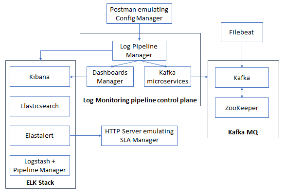

# 3. Automated microservices deployment with DNS (Kubernetes)

This README file contains all the steps to be followed to deploy this scenario, based on Kubernetes, in which it is presented the Log Monitoring platform based on microservices. It also includes Filebeat, but it is executed in the same server, and not as a pod. Kubernetes DNS utility is used to manage the connection between containers.



## Docker images involved

The following Docker images have been used for this deployment. Please verify that these images have been built beforehand.

> Use --no-cache option when building the images if you find problems with the apt-get update command.

* **Create Kafka Topic:** available in this repository: [create_kafka_topic](../../docker_images/create_kafka_topic).
* **Delete Kafka Topic:** available in this repository: [delete_kafka_topic](../../docker_images/delete_kafka_topic).
* **ElastAlert:** available in this repository: [elastalert](../../docker_images/elastalert/v2.6_DNS).
* **Elasticsearch:** available in this repository: [elasticsearch](../../docker_images/elasticsearch/vDNS2).
* **Fetch Kafka Topic:** available in this repository: [fetch_kafka_topic](../../docker_images/fetch_kafka_topic).
* **HTTP server:** available in this repository: [kafka](../../docker_images/http_server).
* **Kafka:** available in this repository: [kafka](../../docker_images/kafka/vDNS2).
* **Kafka Consumer:** available in this repository: [kafka_consumer](../../docker_images/kafka_consumer).
* **Kibana:** available in this repository: [kibana](../../docker_images/kibana/vDNS2).
* **Kibana Dashboard:** available in this repository: [kibana_dashboards](../../docker_images/kibana_dashboards/vDNS2_scraper).
* **Log Pipeline Manager:** available in this repository: [log_pipeline_manager](../../docker_images/log_pipeline_manager/vDNS).
* **Logstash Pipeline Manager:** available in this repository: [logstash_pipeline_manager](../../docker_images/logstash_pipeline_manager/v2).
* **ZooKeeper:** available in this repository: [zookeeper](../../docker_images/zookeeper/v2).

## Steps to be followed

For the moment, it is necessary to create a namespace where all pods will be launched.

In order to do so, execute the following code lines:  

```sh
$ kubectl create namespace dns-deployment2
$ kubectl config set-context --current --namespace=dns-deployment2
```
### 1. Run all pods with its entrypoint already executed

Before running the pods, check the following:

* The Kubernetes node uses Docker as container daemon.
* You have built all the Docker images referenced in pods' specification.

**And IMPORTANT: go to the [Kibana Dashboard pod specification](pods/kibana_dashboard_pod.yml) and change the third argument (IP address 10.9.8.188) for the IP in which you are executing this scenario.**

Then, execute the following (you have to be in the directory containing this README to execute these commands).

> For the ElastAlert pod, the file pods/config_map/elastalert_pod_config_map.yml can be alternatively used if you want to have all ElastAlert server parameters included in the same pod definition file.  

It is very important to follow the following sequence. Since the vast majority of pods depend on zookeeper and elasticsearch, these two pods shall be deployed in the fist place.

```sh
$ kubectl apply -f ./pods/elasticsearch_pod.yml
$ kubectl apply -f ./pods/zookeeper_pod.yml
```

After waiting some seconds and proving that they are correctly Running, run the rest of the pods

```sh
$ kubectl apply -f ./pods/create_kafka_topic_pod.yml
$ kubectl apply -f ./pods/delete_kafka_topic_pod.yml
$ kubectl apply -f ./pods/elastalert_pod.yml
$ kubectl apply -f ./pods/fetch_kafka_topic_pod.yml
$ kubectl apply -f ./pods/http_server_pod.yml
$ kubectl apply -f ./pods/kafka_pod.yml
$ kubectl apply -f ./pods/kafka_consumer_pod.yml
$ kubectl apply -f ./pods/kibana_pod.yml
$ kubectl apply -f ./pods/kibana_dashboard_pod.yml
$ kubectl apply -f ./pods/log_pipeline_manager_pod.yml
$ kubectl apply -f ./pods/logstash_pipeline_manager_pod.yml
```
You can check its creation by means of:

```sh
$ kubectl get pods -o wide
```

You should obtain something like this:

```
NAME                                       READY   STATUS    RESTARTS   AGE   IP           NODE             NOMINATED NODE   READINESS GATES
elasticsearch-7677597f95-66xzt             1/1     Running   0          11m   10.42.0.80   log-monitoring   <none>           <none>
zookeeper-74b54ff96-v5csq                  1/1     Running   0          11m   10.42.0.81   log-monitoring   <none>           <none>
elastalert-6d975d4bd8-q5z48                1/1     Running   0          86s   10.42.0.83   log-monitoring   <none>           <none>
deletekafkatopic-5ff799c4d6-88lkw          1/1     Running   0          87s   10.42.0.82   log-monitoring   <none>           <none>
fetchkafkatopic-7df66444cc-9t7k6           1/1     Running   0          86s   10.42.0.84   log-monitoring   <none>           <none>
httpserver-cf567b948-swghq                 1/1     Running   0          85s   10.42.0.85   log-monitoring   <none>           <none>
kafka-6c64b4c7c4-z86z9                     1/1     Running   0          85s   10.42.0.86   log-monitoring   <none>           <none>
kibana-7b85f4ccf-j78rh                     1/1     Running   0          83s   10.42.0.88   log-monitoring   <none>           <none>
kafkaconsumer-54df5747b4-lvpjj             1/1     Running   0          84s   10.42.0.87   log-monitoring   <none>           <none>
logpipelinemanager-6fffc55694-b2qxj        1/1     Running   0          82s   10.42.0.90   log-monitoring   <none>           <none>
kibana-dashboard-546f85b7c4-kfg6j          1/1     Running   0          83s   10.42.0.89   log-monitoring   <none>           <none>
logstashpipelinemanager-54d8d55564-xkc6q   1/1     Running   0          73s   10.42.0.91   log-monitoring   <none>           <none>
createkafkatopic-db66d4969-ssz8l           1/1     Running   0          3s    10.42.0.92   log-monitoring   <none>           <none>
```

You can also check the services deployed with this command:

```sh
$ kubectl get services -o wide
```

You should obtain something like this:

```
NAME                      TYPE        CLUSTER-IP      EXTERNAL-IP   PORT(S)    AGE    SELECTOR
kubernetes                ClusterIP   10.43.0.1       <none>        443/TCP    14d    <none>
elasticsearch             ClusterIP   10.43.66.149    <none>        9200/TCP   11m    run=elasticsearch
zookeeper                 ClusterIP   10.43.136.175   <none>        2181/TCP   11m    run=zookeeper
deletekafkatopic          ClusterIP   10.43.208.251   <none>        8290/TCP   107s   run=deletekafkatopic
elastalert                ClusterIP   10.43.152.208   <none>        3030/TCP   106s   run=elastalert
fetchkafkatopic           ClusterIP   10.43.97.109    <none>        8390/TCP   106s   run=fetchkafkatopic
httpserver                ClusterIP   10.43.13.76     <none>        8000/TCP   105s   run=httpserver
kafka                     ClusterIP   10.43.89.198    <none>        9092/TCP   105s   run=kafka
kafkaconsumer             ClusterIP   10.43.91.216    <none>        8291/TCP   104s   run=kafkaconsumer
kibana                    ClusterIP   10.43.88.2      <none>        5601/TCP   103s   run=kibana
kibana-dashboard          ClusterIP   10.43.16.204    <none>        8080/TCP   103s   run=kibana-dashboard
logpipelinemanager        ClusterIP   10.43.92.59     <none>        8987/TCP   102s   run=logpipelinemanager
logstashpipelinemanager   ClusterIP   10.43.169.157   <none>        8191/TCP   93s    run=logstashpipelinemanager
createkafkatopic          ClusterIP   10.43.139.250   <none>        8190/TCP   23s    run=createkafkatopic
```

To use the correct container names, you can save their names by using the following script.

> **This script must be executed in every single terminal being used**

```sh
$ source scripts/1_save_variables.sh
```

Each pod will have already executed its entrypoint. Each pod's configuration will be ready and the simple workflow must be followed: create topic, create dashboard, create alert.

For example, you can check in ZooKeeper pod that Kafka has correctly joined to ZooKeeper:

```sh
$ kubectl exec -it $zookeeper_pod -- /opt/kafka/bin/zookeeper-shell.sh zookeeper:2181 ls /brokers/ids
```

The broker_id will appear on the terminal. In this case, the broker_id was set to "1" and therefore a [1] appears on the screen, like this:

```
Connecting to zookeeper:2181

WATCHER::

WatchedEvent state:SyncConnected type:None path:null
[1]
```

### 2. Create a new topic from the Config Manager side

Create a new topic in the platform. Use the IP address of the node that contains the Log Pipeline Manager pod, changing *<node_containing_log_pipeline_manager_pod_ip_address>* as a result. The variable *<topic_name>*, also known as nsId, must be set before sending the request.

> You can also execute this request with the POST Create Topic request from the [Postman collection](test/Requests.json). _Remember to change the IP address and topic name in that case._ 

```sh
$ curl --location --request POST 'http://<node_containing_log_pipeline_manager_pod_ip_address>:8987/job/<topic_name>' \
--header 'Content-Type: application/json' 
```

If you list the topics currently created, you will see that <topic_name> has been created.

### 3. Create Kibana Dashboard from the Config Manager side

Create a new dashboard for the already created topic in the platform. Use the IP address of the node that contains the Log Pipeline Manager pod, changing *<node_containing_log_pipeline_manager_pod_ip_address>* as a result. The variable *<topic_name>*, also known as nsId, must be set before sending the request.

> You can also execute this request with the POST Create Dashboard request from the [Postman collection](test/Requests.json). _Remember to change the IP address and topic name in that case._ 

```sh
$ curl --location --request POST 'http://<node_containing_log_pipeline_manager_pod_ip_address>:8987/kibanaDashboard' \
--header 'Content-Type: application/json' \
--data-raw '{
"dashboardTitle": "NS_<topic_name>",
"ns_id": "<topic_name>",
"dashboard_type": "vm_logs"
}'
```

Kibana will respond with the <dashboardId> parameter, which will be later on used to delete the dashboard, so keep it saved.

```
{
  "dashboardId":"<dashboardId>",
  "dashboardTitle":"NS_<topic_name>",
  "dashboard_type":"vm_logs",
  "ns_id":"<topic_name>",
  "url":"http://<node_containing_kibana_pod_ip_address>:5601/app/kibana#/dashboard/<dashboardId>?embed=true&_g=(refreshInterval:(pause:!f,value:10000))"
}
```

### 4. Post ElastAlert alert rule to ElastAlert server's REST API

Create a new Elastalert rule for the already created topic in the platform. Use the IP address of the node that contains the Log Pipeline Manager pod, changing *<node_containing_log_pipeline_manager_pod_ip_address>* as a result. The variable *<topic_name>*, also known as nsId, must be set before sending the request.

You also have to change the content of *query* field, to put the condition to be met to trigger the alarm. For example, put there a "*3*", so that if the message contains a 3, it triggers the alarm. You can also test the case of "not_match" in the "kind" field, so that the alert will be triggered when the first message that does not match with the query field arrives.

> You can also execute this request with the POST Create Alert request from the [Postman collection](test/Requests.json). _Remember to change the IP address, the IP address of the target and the topic name in that case._ 

```sh
$ curl --location --request POST 'http://<node_containing_log_pipeline_manager_pod_ip_address>:8987/alert' \
--header 'Content-Type: application/json' \
--data-raw '{
"alertName": "alert_name",
"labels": [],
"query": "*3*",
"severity": "warning",
"for": "20s",
"target": "httpserver:8000/alert_receiver",
"kind": "match",
"index": "<topic_name>"
}'
```

This alert rule instructs Elastalert server to monitor Elasticsearch index's frequency and to send alert to the http-server by running an empty curl command.

The response should be like the following one. Take note of the *<alert_id>* provided, because it will be used afterwards for deleting the rule.

```
{
  "alertId":"<alertId>",
  "alertName":"alert_name",
  "for":"20s",
  "index":"<topic_name>",
  "kind":"match",
  "labels":[],
  "query":"*3*",
  "severity":"warning",
  "target":"httpserver:8000/alert_receiver"
}
```

Finally, to check that the rule has been correctly generated, you can check if the file has been created in the corresponding directory in Elastalert pod, together with its content (after checking the <alertId> generated).

```sh
$ kubectl exec -it $elastalert_pod -- ls ../elastalert/rules
$ kubectl exec -it $elastalert_pod -- cat ../elastalert/rules/<alertId>.yaml
```

### 5. Create LogScraper

With the following steps, you can create a LogScraper listening to the topic that you have already created, publishing the data in another Kafka topic.

First of all, create the Kafka topic to be used by sending this request to the Create Kafka Topic microservice (just change <node_containing_create_kafka_topic_pod_ip_address> and <topic_name_scraper> accordingly):

```sh
$ curl --location --request POST 'http://<node_containing_create_kafka_topic_pod_ip_address>:8190/create_kafka_topic' \
--header 'Content-Type: application/json' \
--data-raw '{ "topic": "<topic_name_scraper>" }'
```

If you list the topics currently created, you will see that <topic_name_scraper> has been created.

```sh
$ /bin/bash scripts/6_check_topic_list.sh
```

Then, send the request to the Log Pipeline Manager to create the LogScraper. Remember to change <node_containing_log_pipeline_manager_pod_ip_address>, <topic_name> and <topic_name_scraper> with their correct values. Note that this scraper will only send data in which the number "3" is included, according to the expression field provided.

> You can also execute this request with the POST Create Scraper request from the [Postman collection](test/Requests.json). _Remember to change the IP address, the topic names and the expression in that case._ 

```sh
$ curl --location --request POST 'http://<node_containing_log_pipeline_manager_pod_ip_address>:8987/logScraper' \
--header 'Content-Type: application/json' \
--data-raw '{
"nsid": "<topic_name>",
"vnfid": "whatever",
"performanceMetric": "logs",
"kafkaTopic": "<topic_name_scraper>",
"interval": "15",
"expression": "3"
}'
```

The response should be like the following one. Take note of the *<scraper_id>* provided, because it will be used afterwards for deleting the rule.

```
{
  "expression":"3",
  "interval":"15",
  "kafkaTopic":"<topic_name_scraper>",
  "nsid":"<topic_name>",
  "performanceMetric":"logs",
  "scraper_id":"<scraper_id>",
  "vnfid":"whatever"
}
```

If you check the logs in the Dashboards Manager, you will check that a Scraper is running and gathering data from Elasticsearch to publish new data in Kafka each "interval" seconds.

### 6. Run Filebeat

Follow the following steps to install Filebeat in a specific server (if not installed previously):

```sh
$ cd /tmp
$ wget https://artifacts.elastic.co/downloads/beats/filebeat/filebeat-7.5.0-amd64.deb
$ dpkg -i /tmp/filebeat-7.5.0-amd64.deb
$ rm /tmp/filebeat-7.5.0-amd64.deb

# Check that Filebeat service is stopped (we will execute it manually)
$ systemctl stop filebeat
```

Then, remove the Filebeat configuration file provided by default:

```sh
$ rm /etc/filebeat/filebeat.yml
```

Create a new */etc/filebeat/filebeat.yml* with the following content, changing *<node_containing_kafka_pod_ip_address>*  and <topic_name> consequently. 

```
filebeat.inputs:
  - type: log
    paths:
      - /var/log/<topic_name>.log
output.kafka:
  hosts: ["<node_containing_kafka_pod_ip_address>:9092"]
  topic: "<topic_name>"
```

Do not forget to include an entry in the /etc/hosts file in Filebeat's server with the following content, changing *<node_containing_kafka_pod_ip_address>* consequently:

```
<node_containing_kafka_pod_ip_address> kafka
```

And finally, in a different terminal, check that the configuration file provided before is correct and run Filebeat:

```sh
$ filebeat test config
$ filebeat test output
$ filebeat -e -d "publish" # alternative: systemctl start filebeat -> and check the logs with journalctl -fu filebeat
```

### 7. Start server receiving alerts

Since http-server pod is already running a http server, just execute in a different terminal the following command:

```sh
$ watch -n 5 sudo kubectl logs $http_server_pod
```

It will appear listening to requests on the port 8000 every 5 seconds. This port is used when creating the alert in Step 8. The target was defined on its IP:port, and therefore after generating data in Step 11, an Alert will appear on this terminal.

### 8. Generate data to be published by Filebeat

Open a new terminal in the server containing Filebeat and execute the following commands. After this, you will start publishing data to Filebeat (10 metrics, 1 per second). Remember to change <topic_name> consequently.

```sh
$ sudo su
$ for i in {1..10}; do timestamp=$(date +"%s"); echo "$i"  >> /var/log/<topic_name>.log; sleep 1; done
```

In the terminal containing the HTTP server logs, you will receive then a request from ElastAlert, as the condition defined for the rule has been achieved. If you have a look at the HTTP server terminal, something like this should've appeared.

```
04/05/2021 14:27:52 INFO Request received - POST /alert_receiver
04/05/2021 14:27:52 INFO Data received: {'startsAt': 'Tue May  4 16:27:52 UTC 2021', 'alertname': 'c023539a-ace4-11eb-b80c-e2b576bed96e'}
```

Moreover, check that the system receives the messages sent by the publisher (you can go to the Kibana GUI with http://<node_containin_kibana_pod_ip_address>:5601 and take a look to the Kibana index receiving the data, the Kibana dashboard generated, the Elasticsearch index increasing the counter of messages received, etc.).

And also, check that the LogScraper is sending the data to the corresponding Kafka topic by using a Kafka consumer:

```sh
$ kubectl exec -it $kafka_pod -- /bin/bash
$ /opt/kafka/bin/kafka-console-consumer.sh --bootstrap-server localhost:9092 --topic <topic_name_scraper> --from-beginning
```

You will see something like this:

```
{"record":[{"agent":"be9d9608-db3b-4fe0-b9c0-0554f59adc30","log_path":"\/var\/log\/test1.log","host":"5geve-k3s-master-monit","message":"1","timestamp":"2021-05-21T11:01:26.713Z"},{"agent":"be9d9608-db3b-4fe0-b9c0-0554f59adc30","log_path":"\/var\/log\/test1.log","host":"5geve-k3s-master-monit","message":"2","timestamp":"2021-05-21T11:01:26.713Z"},{"agent":"be9d9608-db3b-4fe0-b9c0-0554f59adc30","log_path":"\/var\/log\/test1.log","host":"5geve-k3s-master-monit","message":"3","timestamp":"2021-05-21T11:01:26.713Z"},{"agent":"be9d9608-db3b-4fe0-b9c0-0554f59adc30","log_path":"\/var\/log\/test1.log","host":"5geve-k3s-master-monit","message":"4","timestamp":"2021-05-21T11:01:26.713Z"},{"agent":"be9d9608-db3b-4fe0-b9c0-0554f59adc30","log_path":"\/var\/log\/test1.log","host":"5geve-k3s-master-monit","message":"5","timestamp":"2021-05-21T11:01:26.713Z"}]}
```

### 9. (Optional) Check messages received in a Kafka consumer

You can also run the subscriber in order to confirm that it receives the messages sent by the publisher (i.e. Filebeat).

Within the Kafka pod, there is a script called kafka-console-consumer.sh which, given the <topic_name>, it shows every single message received in that topic from the beginning to the present time, being continously updated. 

```sh
$ kubectl exec -it $kafka_pod -- /bin/bash
$ cd /opt/kafka
$ bin/kafka-console-consumer.sh --bootstrap-server localhost:9092 --topic <topic_name> --from-beginning
```

### 10. Delete the LogScraper created by the Config Manager

Send the following request. Remember to change <scraperId> with the one obtained when the scraper was created.

> You can also execute this request with the DELETE Delete Scraper request from the [Postman collection](test/Requests.json). _Remember to change the IP address and the topic name (the topic name, in this case, has to be changed with the scraperId) in that case._ 

```sh
$ curl --location --request DELETE 'http://<node_containing_log_pipeline_manager_pod_ip_address>:8987/logScraper/<scraperId>' \
--header 'Content-Type: application/json'
```

Moreover, delete the Kafka topic used with the Delete Kafka Topic microservice. For doing this, just change <node_containing_delete_kafka_topic_pod_ip_address> and <topic_name_scraper> accordingly:

```sh
$ curl --location --request DELETE 'http://<node_containing_delete_kafka_topic_pod_ip_address>:8290/delete_kafka_topic' \
--header 'Content-Type: application/json' \
--data-raw '{ "topic": "<topic_name_scraper>" }'
```

If you list the topics currently created, you will see that <topic_name_scraper> has been deleted.

```sh
$ /bin/bash scripts/6_check_topic_list.sh
```

### 11. Delete the Alert created by the Config Manager

Send the following request. Remember to change <alertId> with the one obtained when the rule was created.

> You can also execute this request with the DELETE Delete Alert request from the [Postman collection](test/Requests.json). _Remember to change the IP address and the topic name (the topic name, in this case, has to be changed with the alertId) in that case._ 

```sh
$ curl --location --request DELETE 'http://<node_containing_log_pipeline_manager_pod_ip_address>:8987/alert/<alertId>' \
--header 'Content-Type: application/json'
```

### 12. Delete the Dashboard created by the Config Manager

Send the following request, using the <dashboardId> you obtained in step 7.

> You can also execute this request with the DELETE Delete Dashboard request from the [Postman collection](test/Requests.json). _Remember to change the IP address and dashboardId (NOT topic_name) in that case._ 

```sh
$ curl --location --request DELETE 'http://<node_containing_log_pipeline_manager_pod_ip_address>:8987/kibanaDashboard/<dashboardId>' \
--header 'Content-Type: application/json'
```

### 13. Delete the topic created by the Config Manager

Remove the topic created previously by the Config Manager by sending this request from the Config Manager side, changing *<node_containing_log_pipeline_manager_pod_ip_address>* and *<topic_name>* as a result.

> You can also execute this request with the DELETE Delete Topic request from the [Postman collection](test/Requests.json). _Remember to change the IP address and topic name in that case._ 

```sh
$ curl --location --request DELETE 'http://<node_containing_log_pipeline_manager_pod_ip_address>:8987/job/<topic_name>' \
--header 'Content-Type: application/json'
```

If you list the topics currently created, you will see that <topic_name> has been deleted.

```sh
$ /bin/bash scripts/6_check_topic_list.sh
```

### 14. Cleaning the scenario

To clean the scenario, you can execute the following commands:

```sh
$ kubectl delete -f ./pods/create_kafka_topic_pod.yml
$ kubectl delete -f ./pods/delete_kafka_topic_pod.yml
$ kubectl delete -f ./pods/elastalert_pod.yml
$ kubectl delete -f ./pods/elasticsearch_pod.yml
$ kubectl delete -f ./pods/fetch_kafka_topic_pod.yml
$ kubectl delete -f ./pods/http_server_pod.yml
$ kubectl delete -f ./pods/kafka_pod.yml
$ kubectl delete -f ./pods/kafka_consumer_pod.yml
$ kubectl delete -f ./pods/kibana_pod.yml
$ kubectl delete -f ./pods/kibana_dashboard_pod.yml
$ kubectl delete -f ./pods/log_pipeline_manager_pod.yml
$ kubectl delete -f ./pods/logstash_pipeline_manager_pod.yml
$ kubectl delete -f ./pods/zookeeper_pod.yml
```

Or directly this one:

```sh
$ kubectl delete -f pods
```

Also remove Filebeat log file for future executions:

```sh
$ rm /var/log/<topic_name>.log
```
