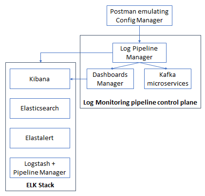

# 4. Automated microservices deployment with DNS (Kubernetes) - production environment

This README file contains all the steps to be followed to deploy this scenario, based on Kubernetes, in which it is presented the Log Monitoring platform based on microservices. Kubernetes DNS utility is used to manage the connection between containers. This platform interacts with external components such as the Kafka Broker or the SLA Manager.



## Docker images involved

The following Docker images have been used for this deployment. Please verify that these images have been built beforehand.

> Use --no-cache option when building the images if you find problems with the apt-get update command.

* **Create Kafka Topic:** available in this repository: [create_kafka_topic](../../docker_images/create_kafka_topic).
* **Delete Kafka Topic:** available in this repository: [delete_kafka_topic](../../docker_images/delete_kafka_topic).
* **ElastAlert:** available in this repository: [elastalert](../../docker_images/elastalert/v2.6_DNS).
* **Elasticsearch:** available in this repository: [elasticsearch](../../docker_images/elasticsearch/vDNS2).
* **Fetch Kafka Topic:** available in this repository: [fetch_kafka_topic](../../docker_images/fetch_kafka_topic).
* **Kafka Consumer:** available in this repository: [kafka_consumer](../../docker_images/kafka_consumer).
* **Kibana:** available in this repository: [kibana](../../docker_images/kibana/vDNS2).
* **Kibana Dashboard:** available in this repository: [kibana_dashboards](../../docker_images/kibana_dashboards/vDNS2).
* **Log Pipeline Manager:** available in this repository: [log_pipeline_manager](../../docker_images/log_pipeline_manager/vDNS).
* **Logstash Pipeline Manager:** available in this repository: [logstash_pipeline_manager](../../docker_images/logstash_pipeline_manager/v2).

## Steps to be followed

For the moment, it is necessary to create a namespace where all pods will be launched.

In order to do so, execute the following code lines:  

```sh
$ kubectl create namespace dns-deployment2
$ kubectl config set-context --current --namespace=dns-deployment2
```
### 1. Run all pods with its entrypoint already executed

Before running the pods, check the following:

* The Kubernetes node uses Docker as container daemon.
* You have built all the Docker images referenced in pods' specification.

**And IMPORTANT: go to the [Kibana Dashboard pod specification](pods/kibana_dashboard_pod.yml) and change the third argument (IP address 10.9.8.188) for the IP in which you are executing this scenario.**

**Moreover, modify the *<kafka_ip_address>* argument in the following pods: [Create Kafka Topic](pods/create_kafka_topic_pod.yml), [Delete Kafka Topic](pods/delete_kafka_topic_pod.yml), [Fetch Kafka Topic](pods/fetch_kafka_topic_pod.yml), [Kafka Consumer](pods/kafka_consumer_pod.yml) and [Logstash](pods/logstash_pipeline_manager_pod.yml).** For example, 10.5.1.188 is one valid IP address for Kafka in one of the testbeds of Mirantis.

Then, execute the following (you have to be in the directory containing this README to execute these commands).

> For the ElastAlert pod, the file pods/config_map/elastalert_pod_config_map.yml can be alternatively used if you want to have all ElastAlert server parameters included in the same pod definition file.  

It is very important to follow the following sequence. Since some pods depend on elasticsearch, that pod shall be deployed in the fist place.

```sh
$ kubectl apply -f ./pods/elasticsearch_pod.yml
```

After waiting some seconds and proving that it is correctly Running, run the rest of the pods

```sh
$ kubectl apply -f ./pods/create_kafka_topic_pod.yml
$ kubectl apply -f ./pods/delete_kafka_topic_pod.yml
$ kubectl apply -f ./pods/elastalert_pod.yml
$ kubectl apply -f ./pods/fetch_kafka_topic_pod.yml
$ kubectl apply -f ./pods/kafka_consumer_pod.yml
$ kubectl apply -f ./pods/kibana_pod.yml
$ kubectl apply -f ./pods/kibana_dashboard_pod.yml
$ kubectl apply -f ./pods/log_pipeline_manager_pod.yml
$ kubectl apply -f ./pods/logstash_pipeline_manager_pod.yml
```
You can check its creation by means of:

```sh
$ kubectl get pods -o wide
```

You should obtain something like this:

```
NAME                                       READY   STATUS    RESTARTS   AGE   IP           NODE             NOMINATED NODE   READINESS GATES
elasticsearch-7677597f95-66xzt             1/1     Running   0          11m   10.42.0.80   log-monitoring   <none>           <none>
elastalert-6d975d4bd8-q5z48                1/1     Running   0          86s   10.42.0.83   log-monitoring   <none>           <none>
deletekafkatopic-5ff799c4d6-88lkw          1/1     Running   0          87s   10.42.0.82   log-monitoring   <none>           <none>
fetchkafkatopic-7df66444cc-9t7k6           1/1     Running   0          86s   10.42.0.84   log-monitoring   <none>           <none>
kibana-7b85f4ccf-j78rh                     1/1     Running   0          83s   10.42.0.88   log-monitoring   <none>           <none>
kafkaconsumer-54df5747b4-lvpjj             1/1     Running   0          84s   10.42.0.87   log-monitoring   <none>           <none>
logpipelinemanager-6fffc55694-b2qxj        1/1     Running   0          82s   10.42.0.90   log-monitoring   <none>           <none>
kibana-dashboard-546f85b7c4-kfg6j          1/1     Running   0          83s   10.42.0.89   log-monitoring   <none>           <none>
logstashpipelinemanager-54d8d55564-xkc6q   1/1     Running   0          73s   10.42.0.91   log-monitoring   <none>           <none>
createkafkatopic-db66d4969-ssz8l           1/1     Running   0          3s    10.42.0.92   log-monitoring   <none>           <none>
```

You can also check the services deployed with this command:

```sh
$ kubectl get services -o wide
```

You should obtain something like this:

```
NAME                      TYPE        CLUSTER-IP      EXTERNAL-IP   PORT(S)    AGE    SELECTOR
kubernetes                ClusterIP   10.43.0.1       <none>        443/TCP    14d    <none>
elasticsearch             ClusterIP   10.43.66.149    <none>        9200/TCP   11m    run=elasticsearch
deletekafkatopic          ClusterIP   10.43.208.251   <none>        8290/TCP   107s   run=deletekafkatopic
elastalert                ClusterIP   10.43.152.208   <none>        3030/TCP   106s   run=elastalert
fetchkafkatopic           ClusterIP   10.43.97.109    <none>        8390/TCP   106s   run=fetchkafkatopic
kafkaconsumer             ClusterIP   10.43.91.216    <none>        8291/TCP   104s   run=kafkaconsumer
kibana                    ClusterIP   10.43.88.2      <none>        5601/TCP   103s   run=kibana
kibana-dashboard          ClusterIP   10.43.16.204    <none>        8080/TCP   103s   run=kibana-dashboard
logpipelinemanager        ClusterIP   10.43.92.59     <none>        8987/TCP   102s   run=logpipelinemanager
logstashpipelinemanager   ClusterIP   10.43.169.157   <none>        8191/TCP   93s    run=logstashpipelinemanager
createkafkatopic          ClusterIP   10.43.139.250   <none>        8190/TCP   23s    run=createkafkatopic
```

To use the correct container names, you can save their names by using the following script.

> **This script must be executed in every single terminal being used**

```sh
$ source scripts/1_save_variables.sh
```

Each pod will have already executed its entrypoint. Each pod's configuration will be ready and the simple workflow must be followed: create topic, create dashboard, create alert.


### 2. Cleaning the scenario

To clean the scenario, you can execute the following commands:

```sh
$ kubectl delete -f ./pods/create_kafka_topic_pod.yml
$ kubectl delete -f ./pods/delete_kafka_topic_pod.yml
$ kubectl delete -f ./pods/elastalert_pod.yml
$ kubectl delete -f ./pods/elasticsearch_pod.yml
$ kubectl delete -f ./pods/fetch_kafka_topic_pod.yml
$ kubectl delete -f ./pods/kafka_consumer_pod.yml
$ kubectl delete -f ./pods/kibana_pod.yml
$ kubectl delete -f ./pods/kibana_dashboard_pod.yml
$ kubectl delete -f ./pods/log_pipeline_manager_pod.yml
$ kubectl delete -f ./pods/logstash_pipeline_manager_pod.yml
```
